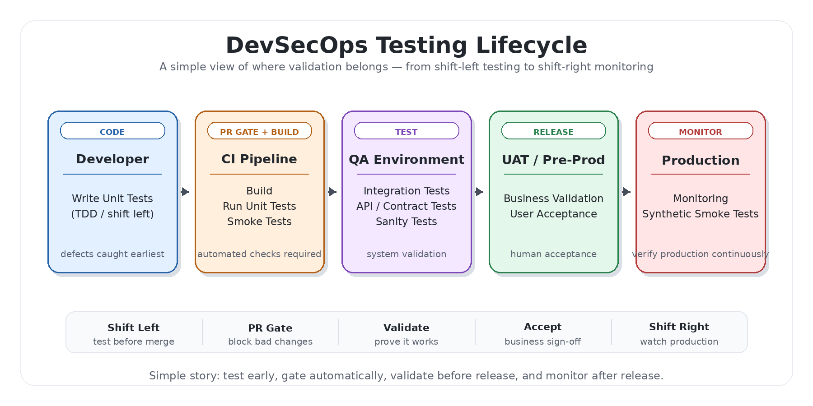

# Testing — redactor

## Exccutive Summary 

In automated software projects, SDLC testing and Test-Driven Development (TDD) are foundational to delivering high-quality, secure, and reliable code through pull requests (PRs). SDLC-aligned testing ensures validation occurs at every stage—from unit and integration to system and user acceptance—while TDD enforces a discipline of writing tests before code, leading to better design, higher coverage, and fewer defects. Together, they create a robust quality gate within CI/CD pipelines, enabling early detection of issues, minimizing regression risk, and improving reviewer confidence. This results in faster, safer PR merges, stronger code integrity, and a scalable DevSecOps lifecycle where automation continuously enforces standards without slowing delivery.




## Quick start

### Recommended — [pyst](https://github.com/wwwizards/ipscan) (smart Python test runner)

**[pyst](https://github.com/wwwizards/ipscan)** is the companion test runner to `psst`. It auto-discovers `test_*.py` files, supports tier-based filtering (`smoke`, `unit`, `integration`), and fans out across multiple Python versions. From this directory:

```bash
python path/to/pyst.py
```

### Fallback — plain pytest

```bash
pytest test_redactor.py -v
```

All tests run in under 10 seconds. No external dependencies, no network calls.

## Test matrix

| Class | What it covers |
|---|---|
| `TestBuildReplacers` | `build_replacers()` return type; literal ordering; longest-match-first guarantee |
| `TestRedactValue` | email, public IP, private-IP exclusion, known name, device, `{local}` capture, no-match passthrough, stats accumulation |
| `TestRedactNode` | flat dict, nested dict, list, `keys_to_skip`, int/bool/None passthrough |
| `TestRedactFileJson` | JSON file redact, dry-run no-write, invalid-JSON → plain-text fallback |
| `TestRedactFilePlainText` | `plain_text=True` on a valid JSON file; `.txt` file; dry-run with `plain_text` |
| `TestCLI` | `--output`, `--dry-run`, `--stats`, `--inplace` (JSON + text), `--plain-text`, `--ext *`, default ext `.json`, in-place output label |
| `TestJsonFallbackStats` | `matched_patterns` is a sorted `list` (not a `set`) on the JSON-decode-error fallback path |

## Coverage notes

- Private-IP exclusion (`10.x`, `172.16-31.x`, `192.168.x`) explicitly asserted
- `{local}` email capture requires the client-domain pattern to appear **before** the generic email pattern in config — the test suite demonstrates this ordering requirement
- `keys_to_skip` values are asserted **not** redacted even when they contain PII-shaped strings
- `--inplace` is tested both for correct file mutation and for the `(in-place)` label in stdout
- `--ext *` glob is tested against a mixed `.json` + `.txt` directory

## Fixture patterns

`cfg_file` — a `tmp_path_factory` fixture that writes `MINIMAL_CONFIG` to a temp file and returns its path. All CLI tests receive `--config cfg_file` so they never depend on `redact-config.json` being present in the repo.

## Running subsets

```bash
# Just the engine (no I/O)
pytest test_redactor.py::TestBuildReplacers test_redactor.py::TestRedactValue test_redactor.py::TestRedactNode -v

# Just file I/O
pytest test_redactor.py::TestRedactFileJson test_redactor.py::TestRedactFilePlainText -v

# Just CLI integration
pytest test_redactor.py::TestCLI -v
```

## Known gaps / future tests

- `redact-config-f5.json` integration (F5 tmsh AS-BUILT patterns — `A.B.x.y` IP style, MAC addresses, cluster names)
- Directory scan with nested subdirectories (currently flat only)
- `--stats` output format assertions (currently only checks count presence, not exact format)
- Unicode / multi-byte content in plain-text mode
- `test_redactor.py` uses flat naming (no tier suffix) — pyst classifies it as `[untiered]`. Future: rename to `test_redactor_unit.py` to enable tier-based filtering.

---

## Test run history

| Date       | Runner                     | Python         | Result               | Duration | Notes                                              |
|------------|----------------------------|----------------|----------------------|----------|----------------------------------------------------|
| 2026-06-05 | pyst v0.1.4 + pytest 9.0.3 | 3.14.5 (win32) | 54 passed / 0 failed | 13.53s   | v0.4.0 — layered YAML config, merge_configs, 11 new tests |
| 2026-06-05 | pyst v0.1.4 + pytest 9.0.3 | 3.14.5 (win32) | 43 passed / 0 failed | 0.78s    | v0.3.0 — pipe mode (stdin→stdout), config fallback |
| 2026-06-05 | pyst v0.1.4 + pytest 9.0.3 | 3.14.5 (win32) | 36 passed / 0 failed | 0.86s    | v0.2.0 — all flags, backreference, CLI integration |
| 2026-06-04 | pytest 9.0.3               | 3.14.5 (win32) | 36 passed / 0 failed | 5.98s    | v0.2.0 initial suite creation                      |
